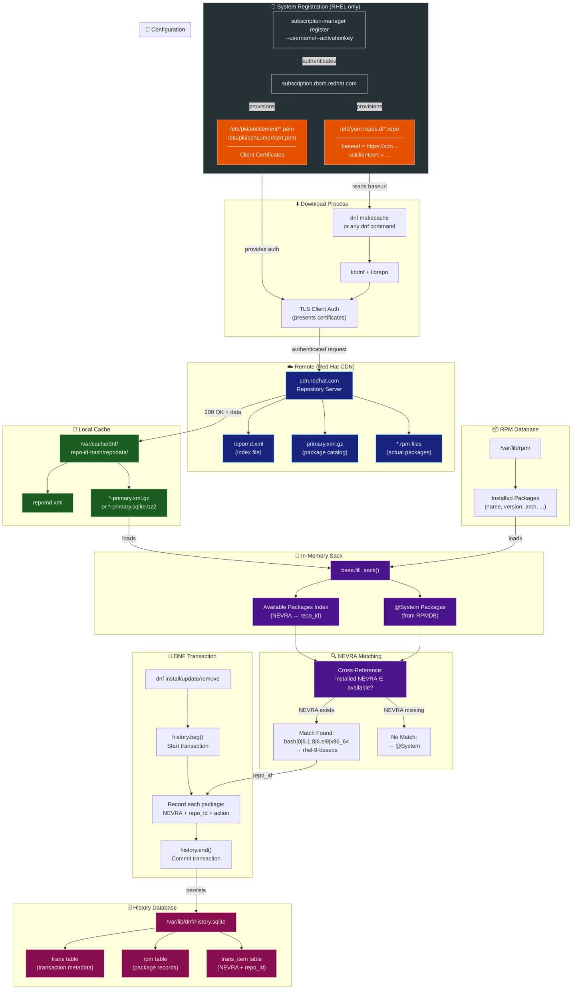
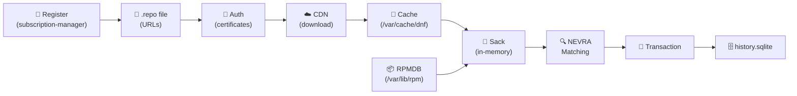

# DNF Data Flow Diagram

This document provides a visual representation of how DNF discovers and records package repository information.

## Complete Data Flow



---

## Simplified Linear Flow



**Note:** For CentOS/Rocky/Alma/Fedora, the registration step is not required (public mirrors).

---

## ASCII Art Version

```
┌─────────────────────────────────────────────────────────────────────────────┐
│                           DNF DATA FLOW                                     │
└─────────────────────────────────────────────────────────────────────────────┘

  STEP 0: REGISTRATION (RHEL only - creates .repo files and certificates)
  ────────────────────────────────────────────────────────────────────────────
  
  ┌──────────────────────────────────────────────────────────────────────────┐
  │  subscription-manager register --username <user> --password <pass>       │
  │                        OR --org <org> --activationkey <key>              │
  └──────────────────────────────────────────────────────────────────────────┘
                                      │
                                      │ Contacts: subscription.rhsm.redhat.com
                                      ▼
  ┌──────────────────────────────────────────────────────────────────────────┐
  │  CREATES:                                                                │
  │    /etc/yum.repos.d/redhat.repo     ← Repository URLs                   │
  │    /etc/pki/consumer/cert.pem       ← System identity                   │
  │    /etc/pki/entitlement/*.pem       ← Subscription proof                │
  └──────────────────────────────────────────────────────────────────────────┘
                                      │
                                      ▼

  CONFIGURATION                    REMOTE                         LOCAL CACHE
  ─────────────                    ──────                         ───────────
  ┌──────────────────┐            ┌──────────────────┐           ┌──────────────────┐
  │ /etc/yum.repos.d │            │  cdn.redhat.com  │           │ /var/cache/dnf/  │
  │ *.repo           │            │                  │           │ <repo>-<hash>/   │
  │ ──────────────── │            │  repomd.xml      │           │ repodata/        │
  │ baseurl=https:// │───────────▶│  primary.xml.gz  │──────────▶│  repomd.xml      │
  │ sslclientcert=.. │            │  *.rpm           │           │  *-primary.xml.gz│
  └──────────────────┘            └──────────────────┘           └──────────────────┘
           │                              ▲                               │
           │                              │                               │
           │         ┌────────────────────┴──────────────────┐            │
           │         │       TLS CLIENT AUTHENTICATION       │            │
           │         │  /etc/pki/entitlement/*.pem           │            │
           │         │  /etc/pki/consumer/cert.pem           │            │
           │         └───────────────────────────────────────┘            │
           │                                                              │
           ▼                                                              ▼
  ┌──────────────────────────────────────────────────────────────────────────┐
  │                          DNF / libdnf                                    │
  │                                                                          │
  │   base.read_all_repos()     base.fill_sack()                             │
  │          │                        │                                      │
  │          ▼                        ▼                                      │
  │   ┌─────────────┐          ┌─────────────────────────────────────────┐  │
  │   │ Repo Config │          │              SACK (in-memory)           │  │
  │   │ - repo IDs  │          │  ┌─────────────────┐ ┌────────────────┐ │  │
  │   │ - URLs      │          │  │ Available Pkgs  │ │ Installed Pkgs │ │  │
  │   │ - enabled   │          │  │ (from cache)    │ │ (from RPMDB)   │ │  │
  │   └─────────────┘          │  │                 │ │                │ │  │
  │                            │  │ {NEVRA: repo}   │ │ {NEVRA: @Sys}  │ │  │
  │                            │  └────────┬────────┘ └───────┬────────┘ │  │
  │                            │           │                  │          │  │
  │                            │           └────────┬─────────┘          │  │
  │                            │                    │                    │  │
  │                            │                    ▼                    │  │
  │                            │           ┌───────────────┐             │  │
  │                            │           │ NEVRA MATCHING│             │  │
  │                            │           │               │             │  │
  │                            │           │ bash|0|5.1.8  │             │  │
  │                            │           │ |6.el9|x86_64 │             │  │
  │                            │           │      ∈        │             │  │
  │                            │           │ available?    │             │  │
  │                            │           └───────┬───────┘             │  │
  │                            └───────────────────┼─────────────────────┘  │
  │                                                │                        │
  │                                    ┌───────────┴───────────┐            │
  │                                    ▼                       ▼            │
  │                              ┌──────────┐           ┌──────────┐        │
  │                              │  MATCH   │           │ NO MATCH │        │
  │                              │ repo_id  │           │ @System  │        │
  │                              └────┬─────┘           └──────────┘        │
  │                                   │                                     │
  └───────────────────────────────────┼─────────────────────────────────────┘
                                      │
                                      ▼
  ┌──────────────────────────────────────────────────────────────────────────┐
  │                         DNF TRANSACTION                                  │
  │                                                                          │
  │   dnf install/update/remove                                              │
  │          │                                                               │
  │          ▼                                                               │
  │   history.beg()  ──▶  Record Items  ──▶  history.end()                   │
  │                       (NEVRA + repo)                                     │
  │                             │                                            │
  └─────────────────────────────┼────────────────────────────────────────────┘
                                │
                                ▼
  ┌──────────────────────────────────────────────────────────────────────────┐
  │                    /var/lib/dnf/history.sqlite                           │
  │  ────────────────────────────────────────────────────────────────────    │
  │                                                                          │
  │   ┌─────────────┐    ┌─────────────────┐    ┌────────────────────────┐  │
  │   │ trans       │    │ rpm             │    │ trans_item             │  │
  │   │ ─────────── │    │ ─────────────── │    │ ────────────────────── │  │
  │   │ id          │    │ item_id         │    │ trans_id               │  │
  │   │ dt_begin    │◀──▶│ name            │◀──▶│ item_id                │  │
  │   │ dt_end      │    │ epoch           │    │ repoid = "rhel-9-base" │  │
  │   │ cmdline     │    │ version         │    │ action = INSTALL       │  │
  │   │ loginuid    │    │ release         │    │ reason = USER          │  │
  │   └─────────────┘    │ arch            │    └────────────────────────┘  │
  │                      └─────────────────┘                                 │
  │                                                                          │
  └──────────────────────────────────────────────────────────────────────────┘
```

---

## Phase-by-Phase Breakdown

### Phase 0: System Registration (RHEL)

Before DNF can access Red Hat repositories, the system must be registered. This creates the `.repo` files and authentication certificates.

```
┌─────────────────────────────────────────────────────────────────────────────┐
│                     RHEL SYSTEM REGISTRATION                                │
└─────────────────────────────────────────────────────────────────────────────┘

  ┌──────────────────────┐
  │ Fresh RHEL Install   │
  │ (no repos configured)│
  └──────────┬───────────┘
             │
             ▼
  ┌──────────────────────────────────────────────────────────────────────────┐
  │  subscription-manager register --username <user> --password <pass>       │
  │                                                                          │
  │  OR (with activation key):                                               │
  │  subscription-manager register --org <org> --activationkey <key>         │
  └──────────────────────────────────────────────────────────────────────────┘
             │
             │  Contacts: subscription.rhsm.redhat.com
             │  Authenticates user/org
             │  Registers system UUID
             │
             ▼
  ┌──────────────────────────────────────────────────────────────────────────┐
  │                    FILES CREATED BY REGISTRATION                         │
  ├──────────────────────────────────────────────────────────────────────────┤
  │                                                                          │
  │  /etc/yum.repos.d/redhat.repo          ◀── Repository definitions       │
  │  ────────────────────────────                                            │
  │  [rhel-9-for-x86_64-baseos-rpms]                                         │
  │  baseurl = https://cdn.redhat.com/...                                    │
  │  sslclientcert = /etc/pki/entitlement/$ID.pem                            │
  │  sslclientkey = /etc/pki/entitlement/$ID-key.pem                         │
  │  ...                                                                     │
  │                                                                          │
  │  /etc/pki/consumer/cert.pem            ◀── System identity certificate  │
  │  /etc/pki/consumer/key.pem             ◀── System identity key          │
  │                                                                          │
  │  /etc/pki/entitlement/$ID.pem          ◀── Subscription entitlement     │
  │  /etc/pki/entitlement/$ID-key.pem      ◀── Entitlement key              │
  │                                                                          │
  │  /etc/rhsm/ca/redhat-uep.pem           ◀── Red Hat CA certificate       │
  │                                                                          │
  └──────────────────────────────────────────────────────────────────────────┘
             │
             ▼
  ┌──────────────────────┐
  │ System Ready for DNF │
  │ (repos + auth ready) │
  └──────────────────────┘
```

**Alternative: Non-RHEL Distributions**

For CentOS, Rocky Linux, AlmaLinux, Fedora:
- `.repo` files are pre-installed with the OS
- No registration required (public mirrors)
- Located in `/etc/yum.repos.d/` after installation

```
┌─────────────────────────────────────────────────────────────────────────────┐
│  CentOS/Rocky/Alma/Fedora: .repo files included in base installation       │
│                                                                             │
│  /etc/yum.repos.d/                                                          │
│  ├── centos.repo          (or rocky.repo, almalinux.repo, fedora.repo)     │
│  ├── centos-addons.repo                                                     │
│  └── ...                                                                    │
│                                                                             │
│  These point to PUBLIC mirrors - no authentication required                 │
└─────────────────────────────────────────────────────────────────────────────┘
```

---

### Phase 1: Configuration Discovery

```
Input:  /etc/yum.repos.d/*.repo
Output: List of (repo_id, baseurl, enabled, ssl_config)

┌────────────────────────────────────────┐
│ [rhel-9-for-x86_64-baseos-rpms]        │
│ baseurl = https://cdn.redhat.com/...   │──▶ repo_id: "rhel-9-for-x86_64-baseos-rpms"
│ enabled = 1                            │    baseurl: "https://cdn.redhat.com/..."
│ sslclientcert = /etc/pki/entitlement/* │    auth:    client certificate
└────────────────────────────────────────┘
```

### Phase 2: Metadata Download

```
Input:  baseurl + certificates
Output: /var/cache/dnf/<repo>-<hash>/repodata/*

GET https://cdn.redhat.com/.../repodata/repomd.xml
    ├── Parse to find: primary.xml.gz location
    │
GET https://cdn.redhat.com/.../repodata/<hash>-primary.xml.gz
    ├── Save to: /var/cache/dnf/<repo>-<hash>/repodata/
    │
Result: Local copy of package catalog
```

### Phase 3: Sack Construction

```
Input:  /var/cache/dnf/*/repodata/ + /var/lib/rpm/
Output: In-memory index

┌─────────────────────────────────────────────────────────────┐
│                         SACK                                │
│                                                             │
│  Available (from cache):          Installed (from RPMDB):   │
│  ─────────────────────           ─────────────────────────  │
│  bash|0|5.1.8|6.el9|x86_64       bash|0|5.1.8|6.el9|x86_64  │
│       → rhel-9-baseos                 → @System             │
│                                                             │
│  kernel|0|5.14.0|362.el9|x86_64  kernel|0|5.14.0|362.el9|.. │
│       → rhel-9-baseos                 → @System             │
└─────────────────────────────────────────────────────────────┘
```

### Phase 4: NEVRA Matching

```
Input:  Sack with available + installed
Output: installed_NEVRA → repo_id mapping

For each installed package:
    key = (name, epoch, version, release, arch)
    
    if key in available_index:
        origin = available_index[key]  # e.g., "rhel-9-baseos"
    else:
        origin = "@System"  # Not found in any repo
```

### Phase 5: Transaction Recording

```
Input:  Transaction results + NEVRA→repo mappings
Output: Records in history.sqlite

Only happens during: dnf install, dnf update, dnf remove, etc.

┌────────────────────────────────────────────────────────────┐
│ Transaction #42                                            │
│ ──────────────────────────────────────────────────────────│
│ Package: bash-5.1.8-6.el9.x86_64                          │
│ Action:  UPGRADE                                           │
│ Repo:    rhel-9-baseos      ◀── This is what gets stored  │
│ Reason:  USER                                              │
└────────────────────────────────────────────────────────────┘
```

---

## Key Insight: When Repo Info is NOT Stored

```
┌─────────────────────────────────────────────────────────────────────────┐
│                     REPO INFO STORAGE RULES                             │
├─────────────────────────────────────────────────────────────────────────┤
│                                                                         │
│  ✅ STORED in history.sqlite:                                           │
│     - Packages installed/updated/removed via DNF                        │
│     - Recorded at transaction time                                      │
│                                                                         │
│  ❌ NOT STORED:                                                         │
│     - Packages installed by Anaconda (initial OS install)               │
│     - Packages installed via `rpm -i` directly                          │
│     - Packages present before first DNF transaction                     │
│                                                                         │
│  🔄 DISCOVERED AT RUNTIME:                                              │
│     - When you run `dnf list installed`                                 │
│     - DNF matches NEVRA against current repo metadata                   │
│     - Result depends on what repos are currently enabled                │
│                                                                         │
└─────────────────────────────────────────────────────────────────────────┘
```

